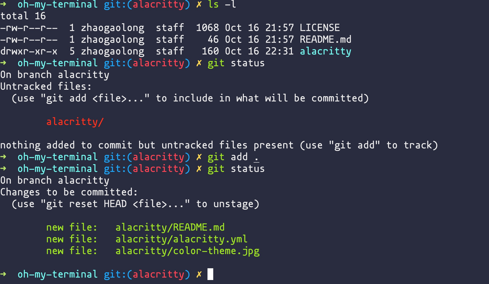

# alacritty

是一个极客喜欢的终端，个人非常推荐，打印数据超快，比 iTerm 快好几倍

## install

    $ brew cask install alacritty

## config

配置文件位置：`~/.config/alacritty/alacritty.yml`

### config font

我个人比较喜欢 `mononoki Nerd Font`
`
字体下载地址：

- https://github.com/ryanoasis/nerd-fonts
- https://github.com/ryanoasis/nerd-fonts/tree/master/patched-fonts/Mononoki

```yml
font:
  # Normal (roman) font face
  normal:
    # Font family
    family: mononoki Nerd Font
```

### config color

发现了一个主题配色仓库：https://github.com/eendroroy/alacritty-theme

我比较喜欢 `argonaut` 主题

```yaml
colors:
  # Default colors
  primary:
    background: "0x292C3E"
    foreground: "0xEBEBEB"

  # Cursor colors
  cursor:
    text: "0xFF261E"
    cursor: "0xFF261E"

  # Normal colors
  normal:
    black: "0x0d0d0d"
    red: "0xFF301B"
    green: "0xA0E521"
    yellow: "0xFFC620"
    blue: "0x1BA6FA"
    magenta: "0x8763B8"
    cyan: "0x21DEEF"
    white: "0xEBEBEB"

  # Bright colors
  bright:
    black: "0x6D7070"
    red: "0xFF4352"
    green: "0xB8E466"
    yellow: "0xFFD750"
    blue: "0x1BA6FA"
    magenta: "0xA578EA"
    cyan: "0x73FBF1"
    white: "0xFEFEF8"
```

# overview


